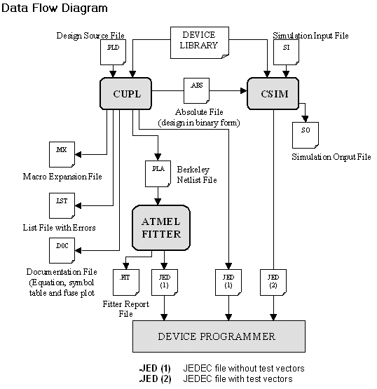

# Overview
This repository centers around modern workflows for Atmel (Now Microchip) 5V GAL PLD and CPLD parts.

These parts are still active and highly worth considering wherever prototyping and 5V logic are a requirement. They can easily replace large numbers of TTL/CMOS logic gates and can be reprogrammed many times.

This repository aims to make it easier to work with the following parts:
* GAL Devices: ATF16V8, ATF22V10 (Require an EPROM Programmer)
* CPLD Devies: ATF1502, ATF1504, ATF1508 (programmable via JTAG)

# Terminology / Background
PLD - <a href="https://en.wikipedia.org/wiki/Programmable_logic_device">Programmable Logic Device</a> 
GAL - <a href="https://en.wikipedia.org/wiki/Programmable_logic_device#GALs">Generic Array Logic</a> 
CPLD - <a href="https://en.wikipedia.org/wiki/Programmable_logic_device#CPLDs">Complex Programmable Logic Device</a> 
<a href="https://www.microchip.com/en-us/products/fpgas-and-plds/spld-cplds/pld-design-resources">WinCUPL</a> - A Windows front-end/IDE to the CUPL compiler and related programs 
CUPL - Compiler for Universal Programmable Logic. (A old programming language for logic. Modern examples would be Verilog/VHDL). WinCUPL ultimately uses CUPL.EXE to compile .PLD files into a .JED file. Assisted Technology released CUPL in September 1983. 
.TT2 - The Berkeley PLA netlist format which CUPL.EXE can generate that can be used by the Atmel fitters. 
EDIF - Another type of netlist format which also is usable by the Atmel fitters. Yosys is capable of generating this format. 
FITTER - A fitter converts a netlist into the fusemap (.JED) file. Fitters are needed for the ATF150x CPLD devices. If my understanding is correct, this is basically place & route. 
.JED/JEDEC File - A fuse map intended to be "burned/programmed" into a logic device. 
.SVF File - Serial Vector Format. This file can be used by any JTAG programmer (vendor-independent) to program a device that has a JTAG interface. 
Wine - Wine is not an emulator. Allows running Windows programs under Linux. 

# Writing logic for these parts: Possible Workflows
Each of these subsections represents a potential workflow to design logic equations for these parts. The majority of the focus will be on modern methods.
## Old Approach: WinCUPL
While logic for these parts can be written via WinCUPL, the experience may be fraught with difficulty as it is somewhat unstable and requires Windows. While it does run under Linux via Wine, it is nonetheless not worth the trouble to use it for serious work considering the number of other options for setting up a workflow, however, it has value in the help files / documentation / examples. To get it working within Wine, you'll need winetricks so you can install mfc40 and mfc42. On Ubuntu, this would look something like:

<code>sudo apt-get install wine winetricks playonlinux
winetricks mfc40 mfc42
</code>

This diagram is from the help files built into WinCUPL:

## Command line approach: CUPL & Your favorite text editor or IDE.
Since WinCUPL simply is a front-end / IDE on top of CUPL and related programs, one can write a CUPL .PLD file in their favorite editor and have CUPL compile it into a .JED file for a PLD.

* <a href="https://www.qsl.net/bh1phl/CUPL_USERS_GUIDE.pdf">A detailed User's Guide to CUPL in PDF</a>

Run CUPL using the following command line format:

<code>cupl [-flags] [library] [device] source</code>

Examples run under Wine would look like this:

<code>wine c:/Wincupl/Shared/cupl.exe -m1lxfjnabep -u c:/Wincupl/Shared/cupl.dl your-code.PLD</code>

Additionally, if you are targeting a CPLD (ATF150x) for which CUPL.EXE does not have direct support, you will need to run:

<code>wine c:/Wincupl/WinCupl/Fitters/fit1502.exe -i your-code.tt2 -dev P1502T44 -DEBUG on -Verilog_sim VERILOG -Out_Edif ON</code>

The above example is for an ATF1502 in a TQFP-44 package. You will need to use the appropriate fitter and device type for your particular CPLD.

Expand here for details of the command line flags for CUPL.EXE

Run CUPL using the following command line format:
<code>cupl [-flags] [library] [device] source
where
-flags is the following set of compiler options:
-j JEDEC download format
-h ASCII-HEX download format
-i HL download format
-n use input filename for output file
-a create absolute file
-l create listing file
-e create expanded macro definition file
-x create expanded product-terms in documentation file
-f create fuse plot/chip diagram in documentation file
-p create PDIF database interchange format file
-b create Berkeley PLA format file
-c create PALASM format file
-d deactivate unused OR terms
-r disable product term merging
-g program security fuse
-o treat all state machines as “one-hot”
-u use specified library for compilation
-s perform logic simulation after compilation
-w perform simulation with waveform output (MS-DOS only)
-m0 no minimization
-m1 quick minimization (default)
-m2 Quine McCluskey
-m3 Presto
-m4 Expresso
-q MIcrosoft format for error messages
-zq QuickLogic’s QDIF file
-kb Optimize product term usage for pin or pinnode variables. This overrides the DEMORGAN statement if it appears in the source file
-kd DeMorganize all pin and pinnode variables. This overrides the DEMORGAN statement if it appears in the source file
-ks Force product term sharing during minimization. This is also referred to as group reduction
-kx Do not expand XOR to AND-OR equations. This is used for device independent designs or designs targeted for fitter-supported devices where the fitter supports XOR gates
</code>

Recently, two different extensions for VS Code for CUPL have been written:
* https://marketplace.visualstudio.com/items?itemName=tlgkccampbell.code-cupl
  * This one handles just syntax highlighting for CUPL .PLD files
* https://marketplace.visualstudio.com/items?itemName=VaynerSystems.VS-Cupl
  * This is an entire workflow, including syntax highlighting.

## Absurd approach: Fusemaps by hand
* See this <a href="https://blog.frankdecaire.com/2017/01/22/generic-array-logic-devices/">blog post</a> by Frank DeCaire.

While not the easiest approach, just as one can write G-Code in notepad or Assembly code in a hex editor, manualy creating a fusemap is technically possible. This assumes that you have a datasheet for your device which has a description of the fusemap and the details of how the macrocells work. With this in hand, one could write a JEDEC file with the desired functionality and a text editor. This would be non-trivial and error-prone, but it demonstrates that such a thing could be done, at least with the older PLDs (16V8, 22V10), and even with the ATF750 (some datasheets actually had the fusemap for this part).

It is worth noting that the fusemap for the ATF150x parts has been recently documented in <a href="https://github.com/whitequark/prjbureau">prjbureau</a>. Given the complexity of these devices over PLDs, writing a fusemap by hand for these parts would probably be a bad idea.

## Other languages: ABEL, PALASM (ancient)
Since we're mostly covering modern approaches to these devices here, these will only be covered very briefly:
* ABEL: "Advanced Boolean Expression Language" was created in 1983 by Data I/O Corporation.
* PALASM: Introduced by Monolithic Memories, Inc. (MMI) in the 1980's
  * A modern version of this called <a href="https://github.com/daveho/GALasm">GALASM</a>

## Atmel Prochip (not free)
Atmel Prochip is not free, however, you may be able to get a trial license from Microchip. It is nonetheless worth installing regardless because there are newer fitters for the ATF150x devices that can be extracted from this installation. These can be used with other workflows and so having these is pretty useful. The newer versions of the fitters should mention version 1918 (3-21-07) when invoked from a command line.

## Quartus (free) via POF2JED
* It turns out that the Altera (Now Intel) <a href="https://www.intel.com/content/www/us/en/software-kit/711791/intel-quartus-ii-web-edition-design-software-version-13-0sp1-for-windows.html?">Quartus 13.0sp1</a> can be used to produce a .POF file targeting various CPLD chips made by Altera in the MAX EPM3K/EPM7K series.
* The resulting .POF file can be converted using a utility called <a href="http://ww1.microchip.com/downloads/archive/pof2jed.zip">POF2JED</a> from Atmel (Now Microchip). This is further detailed in <a href="http://ww1.microchip.com/downloads/en/AppNotes/DOC0916.PDF">this application note.
* Important!: Newer versions will not work. v13.0sp1 last version that had support for the MAX EPM3K/EPM7K chips. Support for these chips has been removed from newer versions of Quartus. You MUST use the old version.

## Digital (free, use schematics instead of logic equations / programming)
"Digital is an easy-to-use digital logic designer and circuit simulator designed for educational purposes." This is an interesting option as one can create a schematic and have a .JED file generated for a GAL16V8 or GAL22V10. If one provides the fitters to Digital, it can produce .JED files for the ATF150x series as well.
https://github.com/hneemann/Digital

## Yosys (Open Sourc + Atmel Fitters)
One can use Yosys Open SYnthesis Suite (Yosys) with the help of the Atmel Fitters a specific CPLD and a techmap to produce .JED files. This allows an almost entirely open-source workflow using Verilog. A good place to start would be using the <a href="https://github.com/YosysHQ/oss-cad-suite-build">OSS CAD Suite</a> to get the big parts of the suite set up. There are two approaches to making this work:
* https://github.com/whitequark/prjbureau
* https://github.com/hoglet67/atf15xx_yosys/

# Programming / Burning
There are a few choices on how the part can actually be programmed depending on whether it supports JTAG.

## PLD Devices (ATF16V8, ATF22V10)
These parts require an EPROM programmer. Additionally, an important gotcha' is that there are many manufacturers of these parts as well as variants within a manufacturer. While the fusemap may be compatible across variants (GAL16V8 from Lattice vs. the ATF16V8 from Atmel/Microchip), THE PROGRAMMING ALGORITHMS ARE NOT! You will need an EPROM programmer with support for the EXACT manufacturer and EXACT part number of the device you have.

## CPLD Devices (ATF1502, ATF1504, ATF1508)
These parts can be programmed via JTAG, so there are a few options.
* Official programmer: https://www.kanda.com/CPLD-Programmers.175.html
  * Software: https://www.microchip.com/en-us/development-tool/ATMISP
* OpenOCD: https://openocd.org/
  * You will need an SVF file to program a device via OpenOCD. This can be created by converting the .JED file using either ATMISP, or fuseconv.py from whitequark/prjbureau

* To generate a .JED file for these devices, you will need the fitters. While WinCUPL has fitters within it, a much more updated version of the fitters is available inside of Atmel Prochip from <a href="https://www.microchip.com/en-us/products/fpgas-and-plds/spld-cplds/pld-design-resources">Microchip's website</a>

## Other CPLD Parts (ATF750, ATF1500)
* These parts do not support JTAG and are a bit more expensive, so they haven't been tried. You'll need an EPROM programmer that supports these.
* In theory the ATF1500 fitter should work fine under Wine and so if fed with a netlist it should work. This means either CUPL.EXE or in theory Yosys with the right techmap could work.
* I believe CUPL should be able to generate a .JED directly for the ATF750 without a fitter.

# Reversing a JED file back into logic equations
Finally, if one is able to read a .JED out of a device, this can be reversed back into equations. These devices all have security fuses, however, which can disable any ability to read out the device. Given a .JED file, the following approaches can be taken to arrive at the equations:
* By hand, comparing the .JED file to the fusemap / macrocells in the datasheet.
* JED2EQN.EXE
* MAME can be compiled with a utility called jedutil