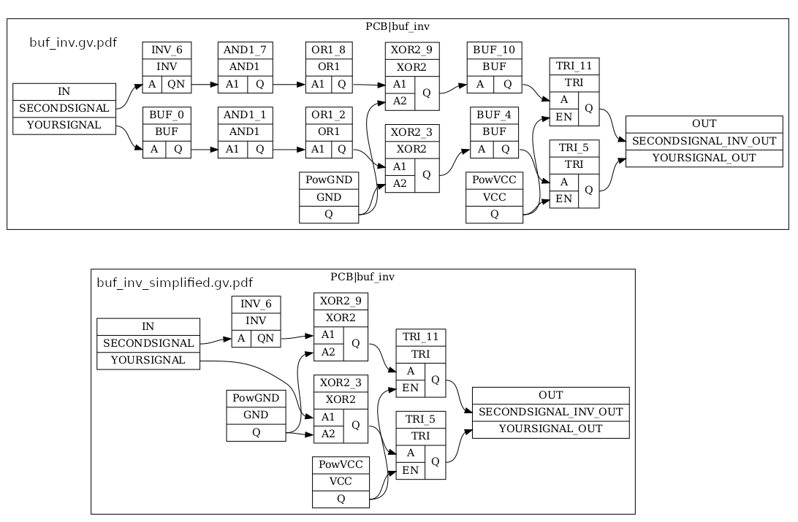

# Overview
This is a small collection of utilities concerned with EDIF netlist files which use the <a href="https://byuccl.github.io/spydrnet/">Spydrnet Framework</a>.
As the Atmel Fitters for the ATF150x CPLDs can both accept and generate these files, these utilities might be helpful.

**Note that you may need to use next_release branch from Spydrnet**

Included here is:
* `edif2dot.py` - An attempt to utilize <a href="https://github.com/JensRestemeier/EdifTests">JensRestemeier/EdifTests "edif2dot.py" script</a> to generate an visualization from an EDIF file generated by the Atmel CPLD fitter for the ATF150x chips. Produces a .gv and a .pdf file.
* `edif2v.py` - A script to demonstrate conversion of EDIF to Verilog using Spydrnet. Produces a .v file.
* `edifsimplify.py` - A script to remove extraneous instances from an EDIF file (Buffers, Single-input OR/AND gates). Produces a new EDIF file.
* `ediftimestamp.sh` - A shell script to modify the timestamp within an EDIF file produced by the Atmel Fitter so that it conforms to what Spydrnet needs. Modifies a file in place and only if necessary.

There are currently some minor issues in Spydrnet which prevent it from parsing files from the Atmel Fitter. See https://github.com/byuccl/spydrnet/issues/215 for more information. These changes appear to be slated for integration into the Fall 2023 release.

# Requirements
You will need spydrnet and graphviz for python. As of 10/24/23, spydrnet needs to be from the next_release branch as some more recent changes are necessary to support these EDIF files:
<code>
git clone -b next_release https://github.com/byuccl/spydrnet.git
cd spydrnet
pip install .
</code>

Otherwise, if the fall_release changes have been widely deployed, this might be sufficient in the future:
<code>
pip install spydrnet
sudo apt-get install python3-graphviz
</code>

# Usage
In order to get EDIF out of the Atmel fitter, the following can be placed in your .PLD file if you are working in CUPL. You can then expect to find a .EDN file after the fitter runs:
<code>
PROPERTY ATMEL { out_edif=on };
</code>

Next, modify your EDIF file to correct the timestamp format within it and try making a graphviz visualization of your netlist. Then simplify it and produce another visualization:
<code>
5vcomp buf_inv.PLD
ediftimestamp.sh buf_inv.edn
edif2dot.py buf_inv.edn
edifsimplify.py buf_inv.edn
edif2dot.py buf_inv_simplified.edf
</code>

# Further work
It would be good to simplify more complex instances that also clutter things up (tristate outputs that are always enabled, two-input XOR instances where one input is always grounded).